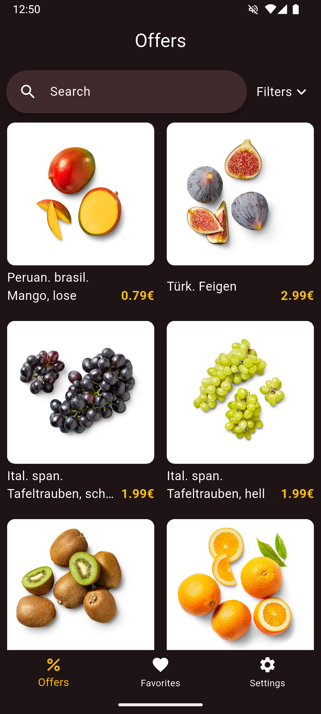
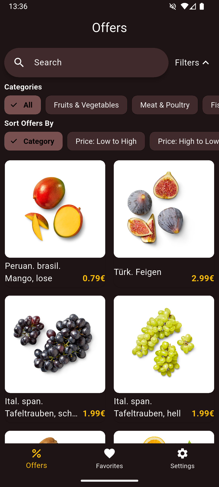
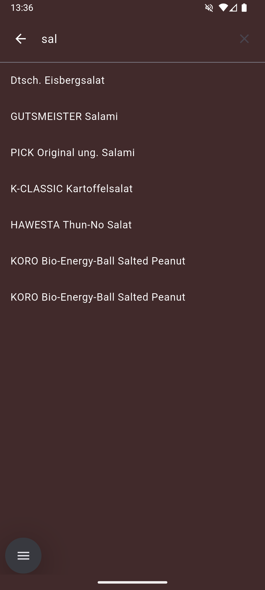
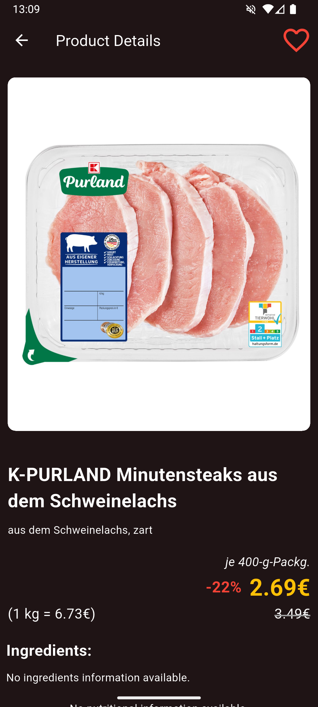
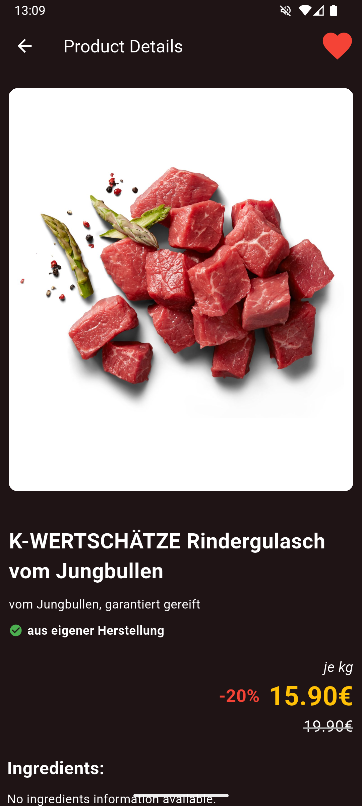
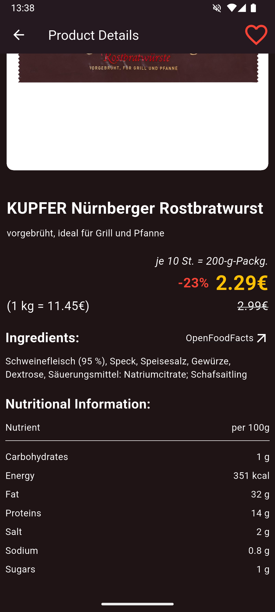
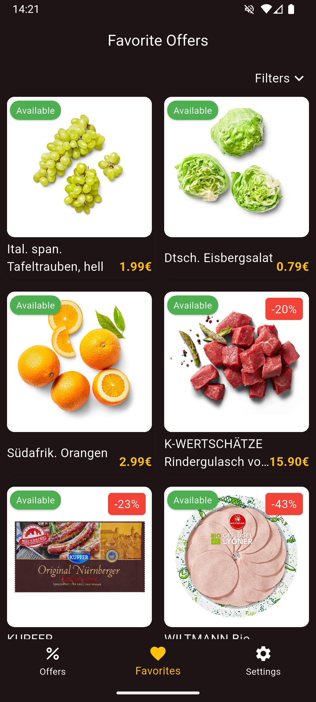
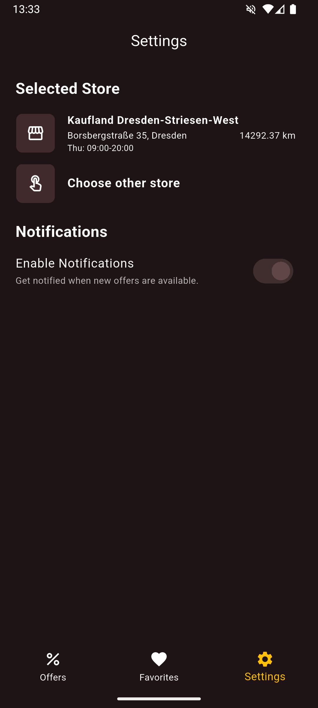
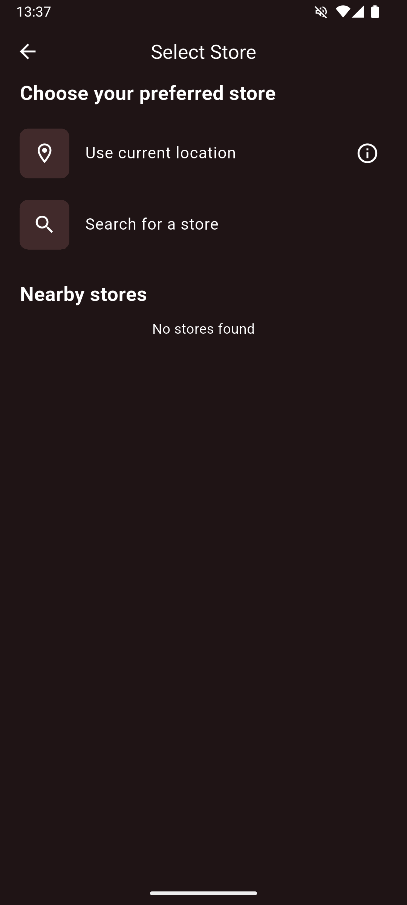
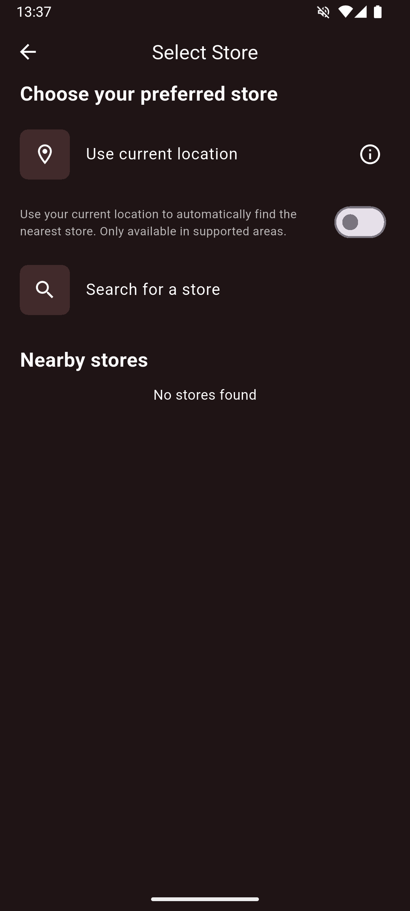

# Kaufi Alert

<p align="center">
  
</p>

## Overview

Kaufi Alert is an **unofficial** mobile application that helps users track and discover current offers at Kaufland stores. The app provides a convenient way to browse current discounts, search for specific products, and receive notifications when new offers become available.

> **DISCLAIMER**: This is an unofficial application that is not affiliated with, authorized, maintained, sponsored, or endorsed by Kaufland or any of its affiliates or subsidiaries. The application uses an unofficial API that is not publicly documented or accessible, and as such, functionality may change without notice if the underlying API changes.

## Features

- 🔍 **Browse Current Offers**: View all active Kaufland offers organized by category
- 🔔 **Notifications**: Get alerted when new weekly offers are published
- ⭐ **Favorites**: Save your favorite offers for quick access
- 🏪 **Store Locator**: Find the nearest Kaufland store based on your location
- 🔍 **Search**: Easily find specific products among current offers
- 📊 **Nutritional Data**: Access detailed product information via OpenFoodFacts integration

<p align="center">
  
   
   
  
  
  
  
  
  
  
</p>

## Technology Stack

- **Flutter**: Cross-platform framework for building the mobile application
- **Dart**: Programming language used with Flutter
- **Local Notifications**: For offer alerts without cloud dependencies
- **WorkManager**: For scheduling background tasks
- **SharedPreferences**: For local data persistence
- **CachedNetworkImage**: For efficient image loading and caching
- **Geolocator**: For finding nearby stores

## Key Benefits

- **Save Money**: Never miss discounts on your favorite products
- **Save Time**: Quickly browse all current offers before shopping
- **Offline Access**: View offers even without an internet connection
- **Privacy-Focused**: No account required, all data stored **locally**
- **Battery Efficient**: Optimized to minimize battery consumption

## Contributing
Contributions are welcome! Please feel free to submit a Pull Request.

## Installation

1. Download the APK from the releases section
2. Enable installation from unknown sources in your device settings
3. Install the application
4. Grant required permissions (location and notifications)

## Development Setup

```bash
# Clone this repository
git clone https://github.com/stortox/KaufiAlert.git

# Navigate to the project directory
cd kaufi_alert_v2

# Install dependencies
flutter pub get

# Run the app
flutter run
```

## Legal
This application is provided for educational and personal use only. The developers are not responsible for any misuse or violation of Kaufland's terms of service.

## License
This project is licensed under the GNU GENERAL PUBLIC LICENSE - see the LICENSE file for details.
